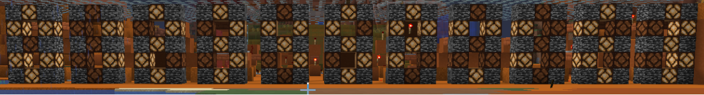

## Block Gate

>A fun Minecraft redstone challenge.
>
>As this is sorta a forensics challenge it may be a good idea to backup the world folder so you don't have to download it over and over (however, there are MANY ways to solve this challenge and you do not necessarily need to make a backup).
>
>Happy hacking!
>
>  * Abjuri5t (John F.)
>
>p.s. Look left immeditaly after spawning-in and see what the water does :-)

###Challenge
Upon loading the Minecraft, we see water is about to destroy the redstone circuit which is is apparently very important to our solution. In fact, it's the main portion to our solution and we won't get anywhere if it's destroyed. I first tried saving it with the `/fill` command by putting a room of acacia_planks but that didn't clear the water that was already under the roof. So after trying to learn how to use the replace subcommand of the `/fill` command I finally was able to save the circut by spamming, `/fill 54 58 -16 20 75 30 minecraft:air replace minecraft:water` until after the water had disappeared entirely from my screen.

###Final soultion wrapup
Now all we had to do was watch a oretty light show and decode the out of the image bellow:

The only hard ones to figure out were luckily on the end and were(from left to right)
>PWI{}
That happens to be our flag format netting us a place to start with the flag.

##Flag
`WPI{02301}`